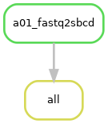
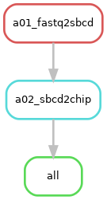
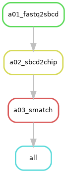
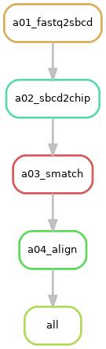
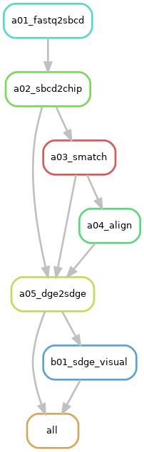
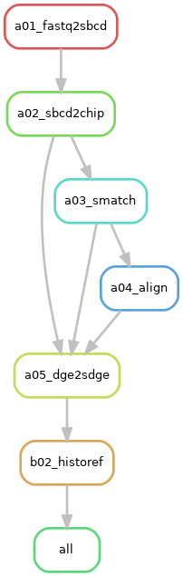
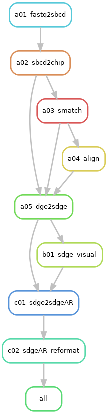
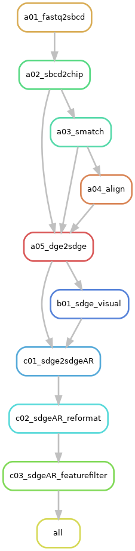
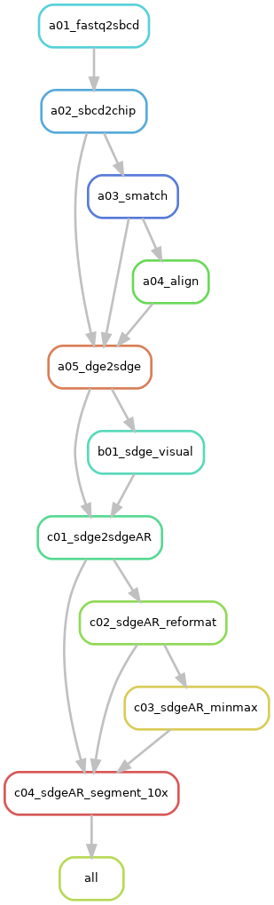

This page provides an overview of the rule execution flow tailored to different **`request`** specified in the [job configuration](../../basic_usage/job_config.md) file of [NovaScope](https://seqscope.github.io/NovaScope/). 

Each `request` option triggers a specific set of rules. Thus, below provides a rulegraph for each `request` option to outline the triggered rules and their interdependencies, detailing distinct processing paths.

!!! info
    The visual guides below are constructed from a **baseline scenario** where only the initial input 1st-seq and 2nd-seq FASTQ files are present, with no prior processing or intermediate files generated.

### `"sbcd-per-flowcell"`
* **Rule Graph**:
<figure markdown="span">
{ width="100%" }
</figure>

### `"sbcd-per-chip"`
* **Rule Graph**:
<figure markdown="span">
{ width="100%" }
</figure>

### `"smatch-per-chip"`
* **Rule Graph**:
<figure markdown="span">
{ width="100%" }
</figure>

### `"align-per-run"`
* **Rule Graph**:
<figure markdown="span">
{ width="100%" }
</figure>

### `"sge-per-run"`
* **Rule Graph**:
<figure markdown="span">
{ width="100%" }
</figure>

### `"histology-per-run"`
* **Rule Graph**:
<figure markdown="span">
{ width="100%" }
</figure>

### `"transcript-per-unit"`
* **Rule Graph**:
<figure markdown="span">
{ width="100%" }
</figure>

### `"filterftr-per-unit"`
* **Rule Graph**:
<figure markdown="span">
{ width="100%" }
</figure>

### `"filterpoly-per-unit"`
* **Rule Graph**:
<figure markdown="span">
{ width="100%" }
</figure>

### `"segment-10x-per-unit"`
* **Rule Graph**:
<figure markdown="span">
{ width="100%" }
</figure>

### `"segment-ficture-per-unit"`
* **Rule Graph**:
<figure markdown="span">
{ width="100%" }
</figure>
