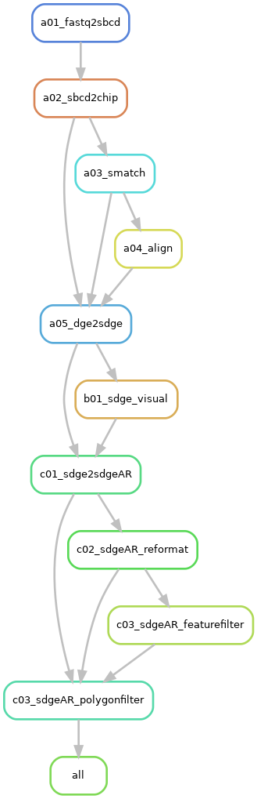

This page provides an overview of the rule execution flow tailored to different **`request`** specified in the [job configuration](../../basic_usage/job_config.md) file of [NovaScope](https://seqscope.github.io/NovaScope/). 

Each `request` option triggers a specific set of rules. Thus, below provides a rulegraph for each `request` option to outline the triggered rules and their interdependencies, detailing distinct processing paths.

!!! info
    The [rulegraphs](./core_concepts.md#rulegraph) below are constructed from a **baseline scenario** where only the initial input 1st-seq and 2nd-seq FASTQ files are present, with no prior processing or intermediate files generated.

### `"sbcd-per-flowcell"`

<figure markdown="span">
{ width="100%" }
</figure>

### `"sbcd-per-chip"`

<figure markdown="span">
{ width="100%" }
</figure>

### `"smatch-per-chip"`

<figure markdown="span">
{ width="100%" }
</figure>

### `"align-per-run"`

<figure markdown="span">
{ width="100%" }
</figure>

### `"sge-per-run"`

<figure markdown="span">
{ width="100%" }
</figure>

### `"histology-per-run"`

<figure markdown="span">
{ width="100%" }
</figure>

### `"transcript-per-unit"`

<figure markdown="span">
{ width="100%" }
</figure>

### `"filterftr-per-unit"`

<figure markdown="span">
{ width="100%" }
</figure>

### `"filterpoly-per-unit"`

<figure markdown="span">
{ width="100%" }
</figure>

### `"segment-10x-per-unit"`
#### Without SGE filtering
* When requesting hexagon-indexed SGE **without** gene-filtering and polygon-filtering:
    <figure markdown="span">
    { width="100%" }
    </figure>

#### With SGE filtering
* When requesting hexagon-indexed SGE **with** gene-filtering and polygon-filtering:
    <figure markdown="span">
    { width="100%" }
    </figure>

### `"segment-ficture-per-unit"`
#### Without SGE filtering
<figure markdown="span">
{ width="100%" }
</figure>

#### With SGE filtering
<figure markdown="span">
{ width="100%" }
</figure>
