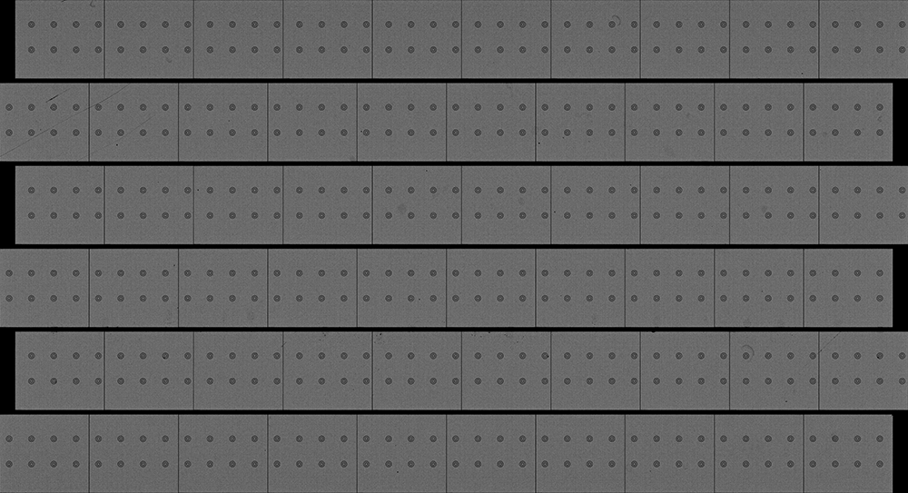

# Rule `sbcd2chip`

## Purpose
The `sbcd2chip` rule is designed to create a spatial barcode map for a chip section of interest. It achieves this by merging the spatial maps of all tiles corresponding to the chip, guided by a spatial barcode layout file.

## Input Files
* **Per-Tile Spatial Barcode Maps & Flow Cell Manifest**
Required inputs are the spatial barcode maps for each tile associated with the chip of interest and the manifest file for the corresponding flow cell. Both inputs are generated by the [`fastq2sbcd`](./fastq2sbcd.md) rule.

* **A Spatial Barcode Layout file**
It is optional to provide a specific spatial barcode layout file for the chip via the [job configuration](../../basic_usage/job_config.md) file. If absent, NovaScope will use the spatial barcode [layout](https://github.com/seqscope/NovaScope/tree/main/info/assets/layout_per_tile_basis) provided by the NovaScope repository. 


## Output Files
The rule generates the following output in the specified directory path: 
```
<output_directory>/seq1st/<flowcell_id>/nbcds/<seq1st_id>
```

### (1) Per-Chip Spatial Barcode Map

**Description**: This is a compressed, tab-delimited file mapping barcodes to global spatial coordinates on the chip, with duplicate barcodes removed. Note that only one spatial barcode map is produced for a chip, both lane ID and tile ID are set to `1`.

**File Naming Convention**: `1_1.sbcds.sorted.tsv.gz`

**File Format**: 

```
AAAAAAAAAAAAGCGACCGGGTAATATATGT	1	1	1413111	2277603	1
AAAAAACATAAGAAAGATCCAAATGACGGTC	1	1	871865	383588	1
AAAAAAGGTACCCGCAGTGCGGACAAACGAA	1	1	1214343	1498113	1
```

- Column 1: Spatial barcode sequence (HDMI, typically 32 base pairs).
- Column 2: Lane ID, which is defined as `1`.
- Column 3: Tile ID, which is defined as `1`.
- Column 4: X-coordinate within the chip (global X-coordinate).
- Column 5: Y-coordinate within the chip (global Y-coordinate).
- Column 6: Count of occurrences for each spatial barcode.

### (2) Per-Chip Manifest File

**Description**:
The manifest file offers summary statistics for the chip of interest. 

**File Naming Convention**: `manifest.tsv` 

**File Format**: 
```
id   filepath                 barcodes  matches  mismatches  xmin  xmax     ymin  ymax
1_1  1_1.sbcds.sorted.tsv.gz  5962994   5962994  0           0     1469211  0     2277916
```

- `id`: The `id` is composed of `<lane_id>_<tile_id>`. Given only one spatial barcode map is created for a chip, the ID is designed as `1_1`.
- `filepath`: The file name is the corresponding spatial barcode map.
- `barcodes`: The number of barcodes in the chip.
- `matches`: The number of barcodes that match to the expected pattern.
- `mismatches`: The number of barcodes that do not match to the expected pattern.
- `xmin`: The minimum x-coordinate across all barcodes in the chip (i.e., minimum global X-coordinate).
- `xmax`: The maximum x-coordinate across all barcodes in the chip (i.e., maximum global X-coordinate).
- `ymin`: The minimum y-coordinate across all barcodes in the chip (i.e., minimum global Y-coordinate).
- `ymax`: The maximum y-coordinate across all barcodes in the chip (i.e., maximum global Y-coordinate).

### (3) An "sbcd" Image

**Description**:
An image to show the distribution of the spatial coordinates of the barcodes, alongside the fiducial marks.

**File Naming Convention**: `1_1.sbcds.sorted.png` 

**File Visualization**:
<figure markdown="span">
{ width="80%" }
</figure>

### (4) A Summary for Duplicate Barcodes
**Description**: 
Each duplicate barcode reports its count and the maximum distance between duplicates, provided it falls within the `dup_maxdist` threshold.

**File Naming Convention**: `dupstats.tsv.gz`

## Output Guidelines
Recommended review steps:
1. Examine [`manifest.tsv`](#2-per-chip-manifest-file) to ensure there are a sufficient number of matched barcodes, and all mismatched barcodes are removed.
2. Inspect [`1_1.sbcds.sorted.png`](#3-an-sbcd-image) to verify that fiducial marks appear empty and align with other fiducial marks both horizontally and vertically.

## Parameters
The following parameter in the [job configuration](../../basic_usage/job_config.md) file will be applied in this rule. 

```yaml
upstream:
  sbcd2chip:
    gap_row: 0.0517
    gap_col: 0.0048
    dup_maxnum: 1
    dup_maxdist: 1
  visualization:
    drawxy:
      coord_per_pixel: 1000
      intensity_per_obs: 50
      icol_x: 3
      icol_y: 4
```

* **The `sbcd2chip` Parameters**
    Those parameters are used to pass values to the [`combine_sbcds`](https://seqscope.github.io/spatula/tools/combine_sbcds/) function in [spatula](https://seqscope.github.io/spatula/). Below, for each parameter, the corresponding parameters in [spatula](https://seqscope.github.io/spatula/), description, and the default value in NovaScope are provided.

    | Parameter     | `spatula` parameter | Description                                                                                   | Default Value |
    |---------------|---------------------|-----------------------------------------------------------------------------------------------|----------------------------|
    | `gap_row`     | `--rowgap`          | Extra gap between rows, based on tile height, for spatial adjustment.                         | 0.0517                     |
    | `gap_col`     | `--colgap`          | Additional gap between columns, based on tile width, for spatial adjustment.                  | 0.0048                     |
    | `dup_maxnum`  | `--max-dup`         | Allowable duplicate count for each barcode, within `dup_maxdist`.                             | 1                          |  
    | `dup_maxdist` | `--max-dup-dist-nm` | Max distance for duplicates, in nanometers.                                                   | 1000                       |

* **The `visualization` Parameters**
    Those are parameters for the [`draw-xy`](https://seqscope.github.io/spatula/tools/draw_xy/) function in [spatula](https://seqscope.github.io/spatula/).

    | Parameter          | `spatula` parameter     | Description                                                                     | Default Value |
    |------------------- |-------------------------|---------------------------------------------------------------------------------|----------------------------|
    | `coord_per_pixel`  | `--coord-per-pixel`     | Coordinates per pixel, as a divisor of input coordinate.                        | 1000                       |
    | `intensity_per_obs`| `--intensity-per-obs`   | Intensity of points per pixel, max 255.                                         | 50                         |
    | `icol_x`           | `--icol-x`              | (0-based) index of X coordinate in input TSV.                                   | 3                          |
    | `icol_y`           | `--icol-y`              | (0-based) index of Y coordinate in input TSV.                                   | 4                          |

## Dependencies
Rule `sbcd2chip` is designed to process data that Rule [`fastq2sbcd`](./fastq2sbcd.md) generates. Therefore, if the [input files](#input-files) are not available, `sbcd2chip` depends on the successful execution of [`fastq2sbcd`](./fastq2sbcd.md) to function correctly. An overview of the rule dependencies are provided in the [Workflow Structure](../../home/workflow_structure.md).

## Code Snippet 
The code for this rule is provided in [a02_sbcd2chip.smk](https://github.com/seqscope/NovaScope/blob/main/rules/a02_sbcd2chip.smk)