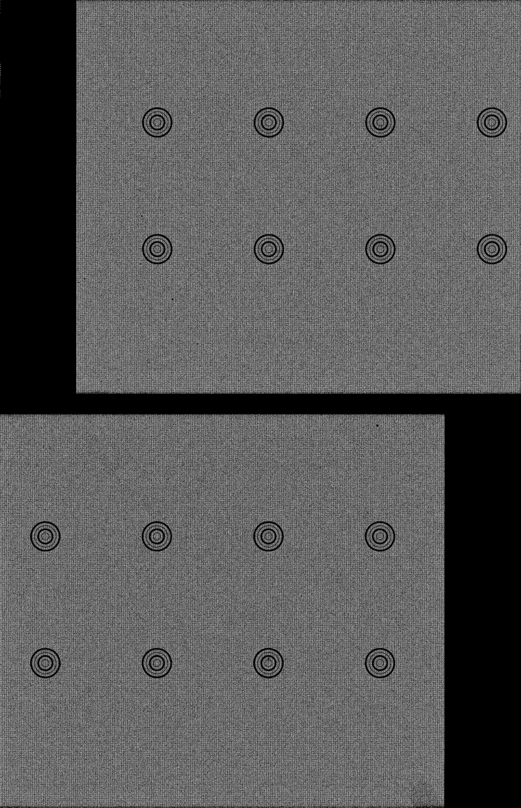
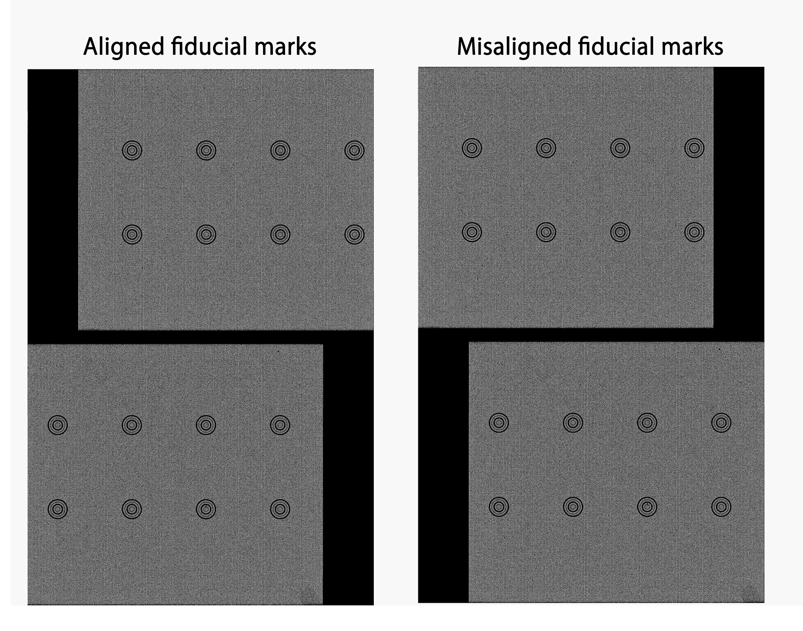

# Rule `sbcd_layout`

## Purpose

The `sbcd_layout` rule helps determine the correct spatial map layout for the input flowcell using tile pairs. Specifically, it applies all layouts on tile pairs and visualizes the corresponding spatial maps, allowing the user to review and choose the correct one based on the alignment of fiducial marks across tiles in a straight line.

!!! info "Spatial Barcode Map Layout"

    There are two layout types:
     
    * **'Top oddshift and bottom evenshift (tobe)'**: the top layer applies an oddshift (horizontally shifting tiles in odd rows) while the bottom layer uses an evenshift (horizontally shifting tiles in even rows).
    * **'Top evenshift and bottom oddshift (tebo)'**: the top layer applies an evenshift while the bottom applies an oddshift.

!!! info "Tile Pairs"

    Users can define tile pairs for layout examination. Each pair should consist of two tiles from the same layer, but different rows, and the same column. Ideally, use two pairs—one from the top layer and one from the bottom. By default, NovaScope uses the tile pairs "1644, 1544" and "2644, 2544."

    Ensure that the tile pairs for spatial map examination are present in the input data by verifying they are listed in the flow cell manifest or by checking for the corresponding per-tile spatial barcode map.


??? "Interpret layer and row information from Tile ID"
     
    The Tile ID is a four-digit number with the following structure:

    - The first digit represents the layer: '1' for the top layer and '2' for the bottom.
    - The second digit indicates the row: if the digit is odd, the tile is in an odd row.
    - The last two digits represent the column information.

## Input Files
* **Per-Tile Spatial Barcode Maps & Flow Cell Manifest**
Required inputs are the spatial barcode maps for each tile pair and the manifest file for the corresponding flow cell. Both inputs are generated by the [`fastq2sbcd`](./fastq2sbcd.md) rule.

## Output Files
The rule generates the following output in the specified directory path:
```
<output_directory>/seq1st/<flowcell_id>/image/<seq1st_id>
```

### Oddshift and Evenshift Spatial Barcode Maps

**Description**: For each tile pair, two images will be provided to display the alignment of the tiles using rowshift and oddshift.

**File Naming Convention**: 

```
<flowcell>.<seq1st_id>.<layer>.<tile1>_<tile2>.<shifttype>.nbcds.png
```

* `<layer>`: "top" or "bottom". NovaScope automatically add layer information in the file name for a better interpretation.
* `<shifttype>`: "oddshift" or "evenshift".

**File Visualization**:
<figure markdown="span">
{ width="50%" }
</figure>

## Output Guidelines
Recommended review steps:

1. Review the oddshift and evenshift spatial barcode maps for each tile pair. Use the alignment of fiducial marks across the tiles to determine the correct spatial barcode layout. Below are the examples of aligned and misaligned tiles.

<figure markdown="span">
{ width="100%" }
</figure>

2. If the oddshift and evenshift spatial barcode maps indicate the 'tebo' layout, the user should revise the job configuration file by setting `layout_shift` in `seq1st` under the `input` section to 'tebo'. If not, no changes are needed, as the default layout_shift is 'tobe'.

## Parameters
The following parameter in the [job configuration](../../basic_usage/job_config.md) file will be applied in this rule.

```yaml
upstream:
  sbcd_layout:                                 
    tiles:                                     
     - "1644,1544"
     - "2644,2544"
    colshift: 0.1715                           
```

* **The `sbcd_layout` Parameters**
* Use `tile` to define tile pairs. One pair should be defined as `"<tile1>,<tile2>"`. NovaScope supports more than one tile pair to be used for layout examination.
* The `colshift` defines the distance of horizontal shift. By default, use 0.1715.

## Dependencies
The execution of Rule `sbcd_layout` depends on whether Rule [`fastq2sbcd`](./fastq2sbcd.md) functions correctly. An overview of the rule dependencies are provided in the [Workflow Structure](../../home/workflow_structure.md).

## Code Snippet 
The code for this rule is provided in [b03_sbcd_layout.smk](https://github.com/seqscope/NovaScope/blob/main/rules/b03_sbcd_layout.smk)