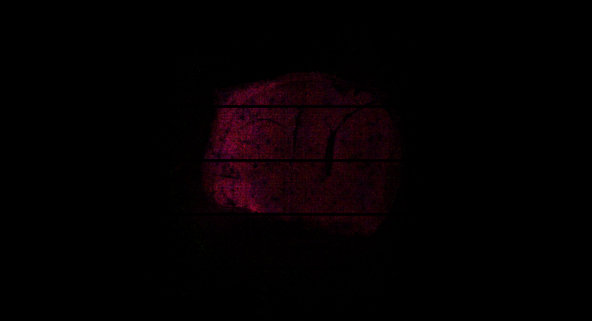

# Rule `sdge_visual`

## Purpose
Rule `sdge_visual` is designed to display the spatial expression of specific gene categories in colors red, green, and blue via [`spatula`](https://seqscope.github.io/spatula/). NovaScope enables the visualization of >=1 gene sets. The gene categories for visualization can be defined in the [`config_job.yaml`](../../basic_usage/job_config.md) file (refer to [Parameters](#parameters)).

## Input Files
* **Spatial Digital Gene Expression Matrix (SGE) and Associated Files**
The necessary inputs include a spatial digital gene expression matrix (SGE), generated by Rule [`dge2sdge`](./dge2sdge.md).

## Output Files
The rule generates the following output in the specified directory path:
```
<output_directory>/align/<flowcell_id>/<chip_id>/<run_id>/sge/<run_id>.sge_visual
```

**Description**: A PNG file is created for each set of genes specified. By default, the spatial expression of non-mitochondrial genes, unspliced genes, and mitochondrial genes are depicted in red, green, and blue, respectively.

**File Naming Convention**:
```
<run_id>.<gene_type_in_red>_<gene_type_in_green>_<gene_type_in_blue>.png
```

The default visualization of non-mitochondrial gene, unspliced genes, and mitochondrial genes will be named as `nonMT_Unspliced_MT.png`.

**File Visualization**:

<figure markdown="span">
{ width="80%" }
</figure>

## Output Guidelines
It is recommended to review the spatial distribution of specified gene sets corresponds with the tissue area.

## Parameters

```
upstream:
  visualization:            ## specify the parameters for visualization
    drawsge:                ## specify the parameters for sdge visualization 
      genes:                ## specify what sets of genes to be colored
        - red: nonMT        ## the first set of genes
          green: Unspliced
          blue: MT
    #   - ...               ## if more set of genes are required
      coord_per_pixel: 1000
      auto_adjust: true
      adjust_quantile: 0.99
```

* **The `genes` Parameter in `drawsge`**
NovaScope includes a selection of predefined gene lists with the following options: all (all genes); nonMT (non-mitochondrial genes); ribosomal (ribosomal genes); MT (mitochondrial genes); and nuclear (nuclear genes). To visualize additional specific gene groups, users can create gene list files (`<prefix>.genes.tsv`) in the directory specified in their [`config_env.yaml`](../../installation/env_setup.md). Additionally, it is possible to visualize individual genes or groups of genes using specific names or regular expressions with [`spatula`](https://seqscope.github.io/spatula/) directly.


* **Other `drawsge` Parameters**
    * `coord_per_pixel` specifies how many coordinates should be merged into one pixel. The default setting is 1000.0.
    * `auto_adjust` controls whether to automatically adjust the color intensity based on the maximum count. It is set to True by default.
    * `adjust_quantile` defines the quantile among non-zero pixels to use for auto-adjustment. The default value is 0.99.

## Dependencies
Given the input from Rule `dge2sdge` serve as the input for `sdge_visual`, Rule `sdge_visual` can only execute if the input SGE is available or the dependent rules have successfully completed their operations. See an overview of the rule dependencies in the [Workflow Structure](../../home/workflow_structure.md).

## Code Snippet
The code for this rule is provided in [`a06_sdge2sdgeAR.smk`](https://github.com/seqscope/NovaScope/blob/main/rules/b01_sdge_visual.smk).


