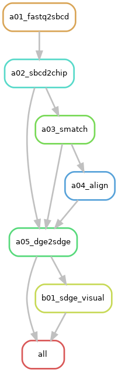
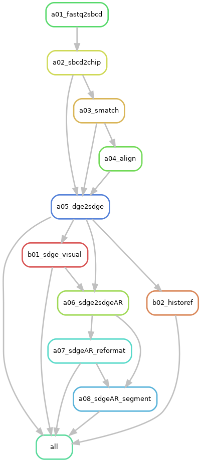

The workflow of [NovaScope](../index.md) can be visualized through the rule graphs provided below. 

For further details on the rules, their execution, and the workflow's structure, please refer to the [NovaScope Walkthrough](../walkthrough/intro.md).

## Main Workflow
The main workflow of NovaScope processes raw sequencing data (1st-seq and 2nd-seq), aligns reads to the reference genome, and generates spatial gene expression at submicron resolution. The rule graph illustrates the relationships between rules:

<figure markdown="span">
{ width="70%" }
</figure>
**Figure 1: Main workflow rule graph.** Each node represents a specific rule in the Snakemake workflow, and arrows indicate dependencies, pointing from prerequisite to dependent rules. Prerequisite rules must be completed before the dependent rule can commence.

## Plus Workflow
In addition to the main functions, NovaScope offers extended [histology alignment and data reformatting capabilities](../index.md#functionality). The plus workflow, detailing both main and additional rules and their interdependencies, is depicted below:

<figure markdown="span">
{ width="70%" }
</figure>
**Figure 2: Plus workflow rule graph.** Each node in this graph represents a rule, with arrows illustrating the flow from prerequisite rules to dependent rules.

