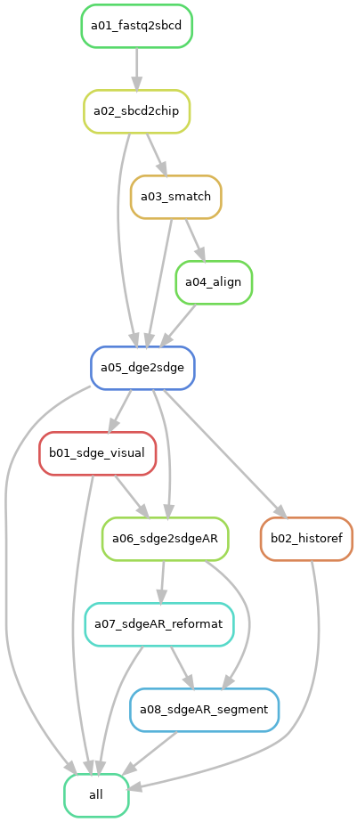

The workflow of [NovaScope](../index.md) can be visualized in the following rule graph.

<figure markdown="span">
{ width="70%" }
</figure>
**Figure 2: The overall flow and dependencies between rules:** Each node in the graph represents a rule within your Snakemake workflow. Each arrow among nodes stands for the rule dependency among rules, with the direction that points from prerequisite rules to a dependent rule. The prerequisite rules must be executed before the dependent rule can start.
