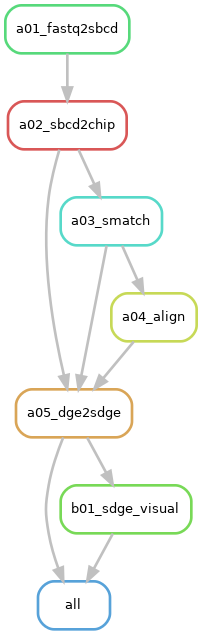
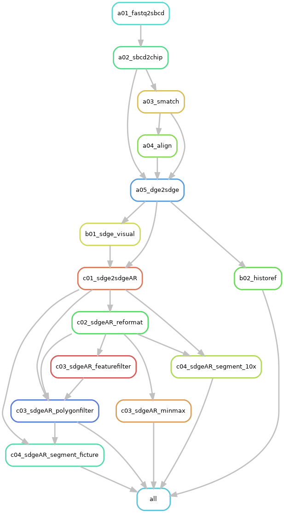

Below is the description of the **main** and **plus** workflows of [NovaScope](../index.md) using rule graphs. 

For further details on the rules, their execution, and the workflow's structure, please refer to the [NovaScope Full Documentation](../fulldoc/intro.md).

??? note "What is a "workflow" and a "rule"?"
    In Snakemake, a workflow is a series of steps designed to process data, defined by rules. Each rule specifies a particular task, such as aligning sequences, filtering data, or converting file formats. Rules are interdependent tasks within a workflow, ensuring tasks are executed in the correct sequence. Below, rule graphs show the dependencies in the main and plus workflows.

## Main Workflow
For the **main function** of NovaScope, the mapping of each step to its specific rule is as follows:

1. Generate spatial maps from the 1st sequencing data (Rules `a01_fastq2sbcd`, `a02_sbcd2chip`)
2. Map the 2nd sequencing data with the spatial map from the 1st step (Rule `a03_smatch`)
3. Align the 2nd sequencing reads to the reference genome (Rule `a04_align`)
4. Generate a spatial digital gene expression (SGE) matrix, indexed by transcripts, at submicron resolution (Rule `a05_dge2sdge`)
5. Visualize the spatial expression of specific genes (Rule `b01_sdge_visual`)

The rule graph illustrates the relationships between rules:

<figure markdown="span">
{ width="70%" }
</figure>
**Figure 1: Main workflow rule graph.** Each node represents a specific rule in the Snakemake workflow, and arrows indicate dependencies, pointing from prerequisite to dependent rules. Prerequisite rules must be completed before the dependent rule can commence.

## Plus Workflow
In addition to the main functions, NovaScope offers **additional capabilities** as below:

1. Histology alignment (Rule `b02_historef`)
2. SGE matrix filtering by gene type, gene name, UMI count, or UMI density (Rules `c03_sdgeAR_featurefilter` and `c03_sdge_polygonfilter`)
3. SGE matrix reformatting from 10x genomics format to a TSV format compatible with FICTURE (Rule `c02_sdgeAR_reformat`)
4. SGE matrix segmentation from transcript-indexed SGE to hexagon-indexed SGE in 10x genomics or FICTURE-compatible TSV format (Rules `c04_sdgeAR_segment_10x` and `c04_sdgeAR_segment_ficture`)

The plus workflow, detailing both main and additional rules and their interdependencies, is depicted below. The prerequisite rules for `sdgeAR_segment_10x` and `sdgeAR_segment_ficture` vary based on the need for SGE matrix filtering.

<figure markdown="span">
{ width="70%" }
</figure>
**Figure 2: Plus workflow rule graph.** In this example workflow, SGE matrix filtering is requested for segmentation in the FICTURE-compatible TSV format (`sdgeAR_segment_ficture`), but not for segmentation in the 10x Genomics format(`c04_sdgeAR_segment_10x`). As shown in the workflow, when SGE matrix filtering is enabled, the prerequisites are `sdge2sdgeAR` and `sdgeAR_polygonfilter`. If filtering is not enabled, the prerequisites are `sdge2sdgeAR`, `sdgeAR_reformat`, and `sdgeAR_minmax`.

