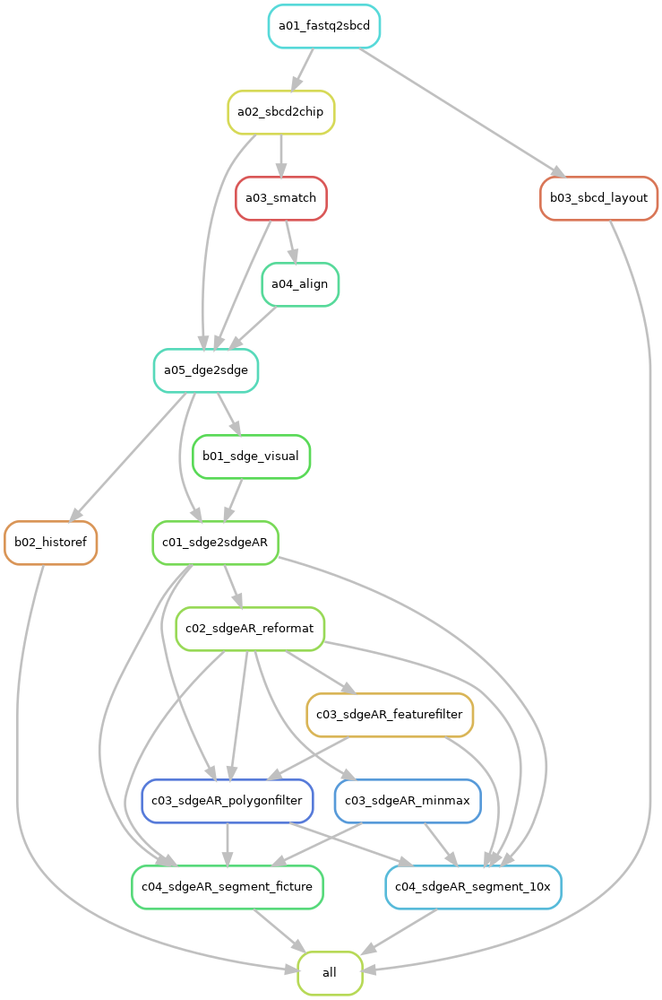

# NovaScope Workflows

Below is the description of the **main** and **plus** workflows of [NovaScope](../index.md) using rule graphs.

For further details on the rules, their execution, and the workflow's structure, please refer to the [NovaScope Full Documentation](../fulldoc/intro.md).

??? note "What is a 'workflow' and a 'rule'?"
    In Snakemake, a workflow is a series of steps for processing data, defined by rules. Each [rule](../fulldoc/execution_guide/core_concepts.md#rule) specifies a task that transforms input files into output files, such as aligning sequences or filtering data. A rule file details the required inputs, resulting outputs, and necessary actions.

??? note "What are 'rule dependencies' and a 'rule graph'?"
    Rule dependencies, determined by input and output files, ensure tasks are executed in the correct sequence within a workflow. Below, we use [rule graphs](../fulldoc/execution_guide/core_concepts.md#rulegraph) illustrate these dependencies in the main and plus workflows, showing how tasks are interconnected and the order of execution.

## Main Workflow

For the **main function** of NovaScope, the mapping of each step to its specific rule is as follows:

1. Generate spatial maps from the 1st sequencing data (Rules `a01_fastq2sbcd`, `a02_sbcd2chip`)
2. Map the 2nd sequencing data with the spatial map from the 1st step (Rule `a03_smatch`)
3. Align the 2nd sequencing reads to the reference genome (Rule `a04_align`)
4. Generate a spatial digital gene expression (SGE) matrix, indexed by transcripts, at submicron resolution (Rule `a05_dge2sdge`)
5. Visualize the spatial expression of specific genes (Rule `b01_sdge_visual`)

The rule graph illustrates the relationships between rules:

<figure markdown="span">
{ width="70%" }
</figure>
**Figure 1: Main workflow rule graph.** Each node represents a specific rule in the Snakemake workflow, and arrows indicate dependencies, pointing from prerequisite to dependent rules. Prerequisite rules must be completed before the dependent rule can commence.

## Plus Workflow

In addition to the main functions, NovaScope offers **additional capabilities** as outlined below:

1. Spatial map layout examination (Rule `b03_sbcd_layout`)
2. Histology alignment (Rule `b02_historef`)
3. SGE matrix filtering by gene type, gene name, UMI count, or UMI density (Rules `c03_sdgeAR_featurefilter` and `c03_sdge_polygonfilter`)
4. SGE matrix reformatting from 10x Genomics format to a TSV format compatible with FICTURE (Rule `c02_sdgeAR_reformat`)
5. SGE matrix segmentation from transcript-indexed SGE to hexagon-indexed SGE in 10x Genomics or FICTURE-compatible TSV format (Rules `c04_sdgeAR_segment_10x` and `c04_sdgeAR_segment_ficture`)

The plus workflow, detailing both main and additional rules and their interdependencies, is depicted below.

<figure markdown="span">
{ width="70%" }
</figure>
**Figure 2: Plus workflow rule graph.** The prerequisite rules for `sdgeAR_segment_10x` and `sdgeAR_segment_ficture` vary based on the need for SGE matrix filtering. This example workflow shows a job requesting a filtered hexagon-indexed SGE in FICTURE-compatible format, but a raw hexagon-indexed SGE in 10x Genomics format. See more details in the [Execution Flow by Request](../fulldoc/execution_guide/rule_execution.md#segment-10x-per-unit).
