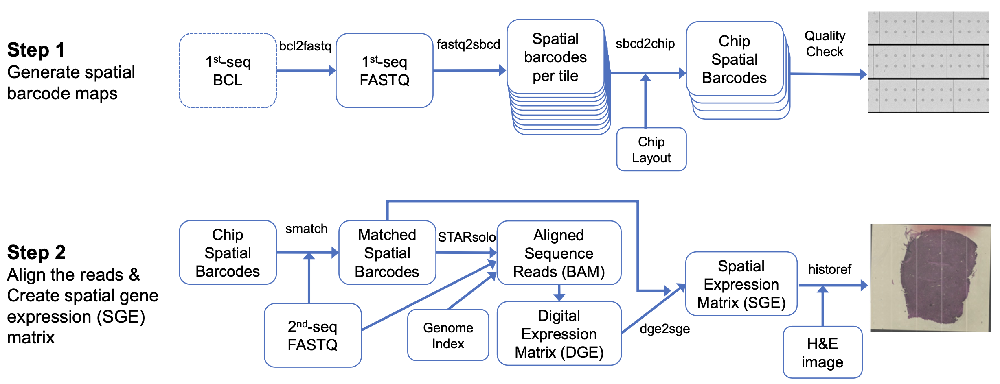

# Welcome to NovaScope documentation

## Introduction
NovaScope is a [Snakemake](https://snakemake.readthedocs.io/en/stable/)-based pipeline that processes spatial transcriptomics data generated from the [Seq-Scope](https://doi.org/10.1016/j.cell.2021.05.010). Currently, it is tailored to process the spatial arrays generated from the Illumina [NovaSeq 6000](https://www.illumina.com/systems/sequencing-platforms/novaseq.html) platform. The preprint for NovaScope is available at [DOI: 10.1101/2024.03.29.587285](https://www.biorxiv.org/content/10.1101/2024.03.29.587285v1).

### Functionality
NovaScope features a modular and adaptable design, enabling users to tailor the pipeline according to their particular requirements.

The **main purpose** of NovaScope is to: 

* process raw sequencing data (1st-seq and 2nd-seq);
* align reads to the reference genome; 
* produce and visualize spatial gene expression at the submicron resolution. 

It also provides **additional functionalities**:

* accurate histological images alignment with transcriptome dataset, 
* conversion of spatial gene expression data for compatibility with [FICTURE](https://seqscope.github.io/ficture/),
* the organization of pixels into customizable hexagonal grids. 

### Infrastructure
This pipeline is built to operate on Unix-based high-performance computing (HPC) platforms, with the capability to run either directly on local systems or via the [Slurm](https://slurm.schedmd.com/documentation.html) workload manager.

### Overview
NovaScope primarily consists of two steps as shown in the figure below.

<figure markdown="span">
{ width="100%" }
</figure>
**Figure 1: Overview of the NovaScope pipeline:** Step 1 processes the 1st-seq FASTQ files to generate spatial barcode maps for each "Chip", a 10x6 array of tiles. Step 2 processes the 2nd-seq FASTQ files, aligns reads to the reference genome, and produces spatial gene expression at submicron resolution.  
