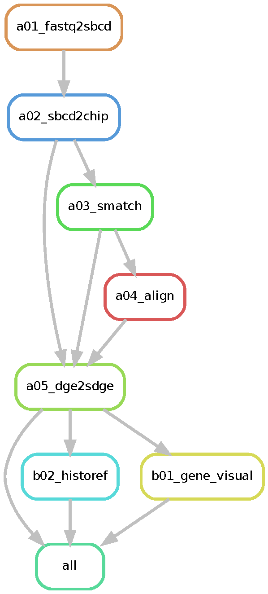

# Welcome to NovaScope documantation

This is the documentation for the NovaScope, a pipeline to preprocess the spatial transcriptomics data from Novaseq.

## Documentation Overview

The current documentation include the following:

* Installation:
    * Requirements: Instructions on how to install necessary software tools and obtain reference datasets.
    * Environment Setup: A quick guide to set up your environment YAML file.
    * Slurm: (Optional) Instructions for creating a configuration file for the SLURM scheduler.
* Getting Started:
    * Preparing Input: How to ready your input data and configuration file.
    * Execute NovaScope: Three options to execute the pipeline.
    * Output: Details on the structure of the output directory and the usage of the produced data.

## An Overview of the Workflow Structure

**Figure 1: The overall flow and dependencies between rules.**
Each node in the graph represents a rule within your Snakemake workflow. Each arrow among nodes stands for the rule dependency among rules, with the direction that points from prerequisite rules to a dependent rule. The prerequisite rules must be executed before the dependent rule can start.
