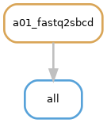
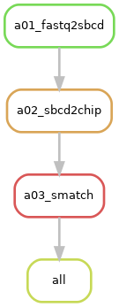
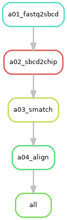
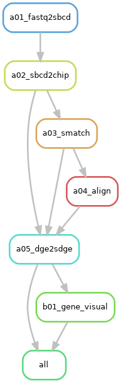

This page provides an overview of the rule execution flow tailored to different **`request`** specified in the [job configuration](../getting_started/job_config.md) file of [NovaScope](https://seqscope.github.io/NovaScope/). 

Each `request` option triggers a specific set of rules. Thus, below provides a rulegraph for each `request` option to outline the triggered rules and their interdependencies, detailing distinct processing paths. It's important to note that these visual guides are constructed from a **baseline scenario** where only the initial input 1st-seq and 2nd-seq FASTQ files are present, with no prior processing or intermediate files generated.

### Request `"sbcd-per-flowcell"`
* **Description**
The `"sbcd-per-flowcell"` option initiates the generation of a spatial barcode map specific to a flow cell. Consequently, [NovaScope](https://seqscope.github.io/NovaScope/) triggers the execution of Rule [`fastq2sbcd`](../rules/fastq2sbcd.md).

* **Rule Graph**:
<figure markdown="span">
{ width="100%" }
</figure>

### Request `"sbcd-per-chip"`
* **Description**
The `"sbcd-per-chip"` option requests a spatial barcode map specific to a given section chip and a plot of the distribution of spatial barcodes, triggering the execution of Rule [`sbcd2chip`](../rules/sbcd2chip.md) and its prerequisite rule: [`fastq2sbcd`](../rules/fastq2sbcd.md).

* **Rule Graph**:
<figure markdown="span">
{ width="100%" }
</figure>

### Request `"smatch-per-chip"`
* **Description**
For each pair of input 2nd-seq FASTQ files associated with a given chip, the `"smatch-per-chip"` option demands two files, including a file of spatial barcodes matched to the 2nd-seq reads alongside its summary metrics, and an image depicting the spatial distribution of those matched barcodes. This request prompts the execution of Rule [`smatch`](../rules/smatch.md) and its prerequisite rules: [`sbcd2chip`](../rules/sbcd2chip.md) and [`fastq2sbcd`](../rules/fastq2sbcd.md).

* **Rule Graph**:
<figure markdown="span">
{ width="100%" }
</figure>

### Request `"align-per-chip"`
* **Description**
The `"align-per-chip"` option request a [Binary Alignment Map (BAM)](http://127.0.0.1:8000/NovaScope/getting_started/job_config/#:~:text=Binary%20Alignment%20Map%20(BAM)) from the alignment as well as the digital gene expression matrices (DGEs) for Gene, GeneFull, splice junctions (SJ), and Velocyto. It provokes the execution of Rule [`align`](../rules/align.md) and its prerequisite rules including [`smatch`](../rules/smatch.md), [`sbcd2chip`](../rules/sbcd2chip.md), and [`fastq2sbcd`](../rules/fastq2sbcd.md).

* **Rule Graph**:
<figure markdown="span">
{ width="100%" }
</figure>

### Request `"sge-per-chip"`
* **Description**
The `"sge-per-chip"` option inquires: 1) a spatial digital gene expression matrix (SGE) encompassing all genomic features with two plots visualizing the distribution of the aligned spatial barcodes; 2) visualization for genes of interest provided in the [job configuration](../getting_started/job_config.md) file. It requests the execution of Rule [`dge2sdge`](../rules/dge2sdge.md) and `gene_visual`, alongside the prerequisite rules: [`align`](../rules/align.md), [`smatch`](../rules/smatch.md), [`sbcd2chip`](../rules/sbcd2chip.md), and [`fastq2sbcd`](../rules/fastq2sbcd.md).

* **Rule Graph**:
<figure markdown="span">
{ width="100%" }
</figure>