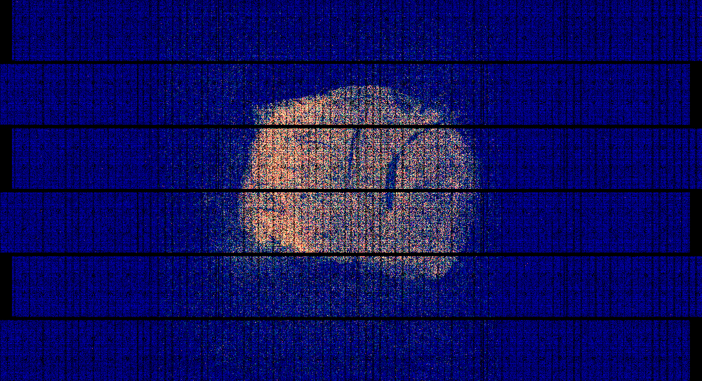

# Rule `dge2sdge`:

## Purpose
The `dge2sdge` generates a spatial digital gene expression (SGE) matrix using the digital gene expression matrix (DGE) from alignment and spatial maps.

## Input Files
* **Per-Chip Spatial Barcode Map and Manifest File**
Required input files include the spatial barcode map and manifest file for the chip of interest, which are created by the [`sbcd2chip`](./sbcd2chip.md) rule.
* **Per-Chip Matched Spatial Barcode Files**
It also requires matched spatial barcode files that contains spatial barcodes matched to the 2nd-seq reads. Those files are generated by the [`smatch`](./smatch.md) rule.
* **DGEs**
DGEs for each genomic feature, including Gene, GeneFull, splice junctions (SJ), and Velocyto, are produced by the [`align`](./align.md) rule.

## Output Files
The rule generates the following output in the specified directory path:
```
<output_directory>/align/<flowcell_id>/<chip_id>/sge/<species>_<seq2nd_version>
```

### (1) Spatial Digital Gene Expression Matrix (SGE)

**Description**: A spatial digital gene expression matrix (SGE) is generated, which contains all available genomic feature,

**File Naming Convention**: The SGE is composed of `barcodes.tsv.gz`, `features.tsv.gz`, and `matrix.mtx.gz`.

**File Format**:

* `barcodes.tsv.gz`:
```
AAAAAAGGTACCCGCAGTGCGGACAAACGA	1	1	1	1	1214343	1498113	1,1,1,0,0
AAAACAGGAGATTCAGAATGCAAAAATGAA	2	2	1	1	1029766	1669474	0,1,0,1,0
AAAACTTGTCGAGCTCAGTGACGCGGGCTT	3	3	1	1	1366819	1170486	2,2,1,0,1
AAAAGCGGTACAGCGTACTCCTATAAGAGT	4	4	1	1	1302024	1519190	6,6,5,0,1
AAAAGGAATAAATGACCTCACGGATAACGT	5	5	1	1	1099465	2041759	1,2,1,1,0
```
    * Column 1: sorted spatial barcodes
    * Column 2: 1-based integer index of the spatial barcode
    * Column 3: 1-based integer index from the full barcode that is in the STARsolo output
    * Column 4: Lane ID, which is defined as `1`.
    * Column 5: Tile ID, which is defined as `1`.
    * Column 6: X-coordinate within the chip (global X-coordinate).
    * Column 7: Y-coordinate within the chip (global Y-coordinate).
    * Column 8: Five comma-separated numbers denote the count per spatial barcode for each genomic feature, in the order of Gene, GeneFull, Spliced, Unspliced, and Ambiguous.

* `features.tsv.gz`:
```
ENSMUSG00000100764	Gm29155	1	2,2,1,0,1
ENSMUSG00000100635	Gm29157	2	0,0,0,0,0
ENSMUSG00000100480	Gm29156	3	0,0,0,0,0
ENSMUSG00000051285	Pcmtd1	4	164,38,35,3,0
ENSMUSG00000097797	Gm26901	5	0,0,0,0,0
```
    * Column 1: Gene Ensemble ID
    * Column 2: Gene symbol
    * Column 3: 1-based integer index which will be used in matrix.mtx.gz
    * Column 4: Five comma-separated numbers denote the count per gene for each genomic feature, in the order of Gene, GeneFull, Spliced, Unspliced, and Ambiguous.

* `matrix.mtx.gz`:
```
%%MatrixMarket matrix coordinate integer general
%
33989 1197304 2488321
5743 1 1 1 1 0 0
6002 2 0 1 0 1 0
7279 3 1 1 1 0 0
7691 3 1 1 0 0 1
2982 4 1 1 0 0 1
```
    * `Header`: Initial lines form the header, declaring the matrix's adherence to the [Market Matrix (MTX) format](https://math.nist.gov/MatrixMarket/formats.html), outlining its traits. This may include comments (lines beginning with `%`) for extra metadata, all marked by a “%”.
    * `Dimensions`: Following the header, the first line details the matrix dimensions: the count of rows (features), columns (barcodes), and non-zero entries.
    * `Data Entries`: Post-dimensions, subsequent lines enumerate non-zero entries in seven columns: row index (feature index), column index (barcode index), and five values (expression levels) corresponds to Gene, GeneFull, Spliced, Unspliced, and Ambiguous.

### (2) An "sge" image
**Description**: The "sge" image illustrates the distribution of spatial barcodes aligned to the reference genome, with exon-aligned transcripts colored red, unspliced transcripts green, and mitochondrial transcripts blue.

**File Naming Convention**:
```
<flowcell_id>.<chip_id>.<species>_<seq2nd_version>.gene_full_mito.png
```

**File Visualization**:
<figure markdown="span">
{ width="80%" }
</figure>

### (3) A Comprehensive View of "sbcd", "smatch", and "sge" Images
**Description**: A side-by-side presentation of three images: the "sbcd" image from [`sbcd2chip`](./sbcd2chip.md), the "smatch" image from [`smatch`](./smatch.md), and the "sge" image generated by the current rule.

**File Naming Convention**:
```
<flowcell_id>.<chip_id>.<species>_<seq2nd_version>.sge_match_sbcd.png
```

**File Visualization**:
<figure markdown="span">
{ width="80%" }
</figure>


## Output Guidelines
It is suggested to review the ["sge" image](#2-an-sge-image) along with the [composite image](#3-a-comprehensive-view-of-sbcd-smatch-and-sge-images) displaying "sbcd", "smatch", and "sge" images together, to confirm: 1) that the "sge" image's spatial distribution of aligned transcripts corresponds with the tissue area, and 2) there is coherence among the "smatch", and "sge" images.

## Parameters
```
  dge2sdge:
    layout: null
```

* **The `layout` Parameter**
The applies as the layout for the RGB plots. When absent, NovaScope use the [predefined layout file](https://github.com/seqscope/NovaScope/blob/docs2/info/assets/layout_per_section_basis/layout.1x1.tsv).

## Dependencies
Given the input from Rule `sbcd2chip`, `smatch`, and `align` serve as the necessary input for `dge2sdge`. This linkage ensures Rule `dge2sdge` can only execute after `sbcd2chip`, `smatch`, and `align` have successfully completed their operations. See an overview of the rule dependencies in the [Workflow Structure](../../home/workflow_structure.md).

## Code Snippet
The code for this rule is provided in [`a05_dge2sdge.smk`](https://github.com/seqscope/NovaScope/blob/main/rules/a05_dge2sdge.smk).
