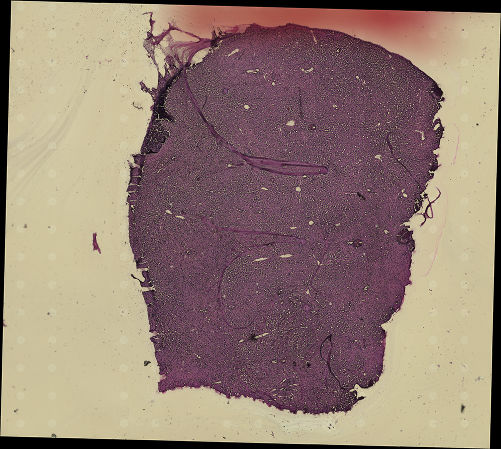
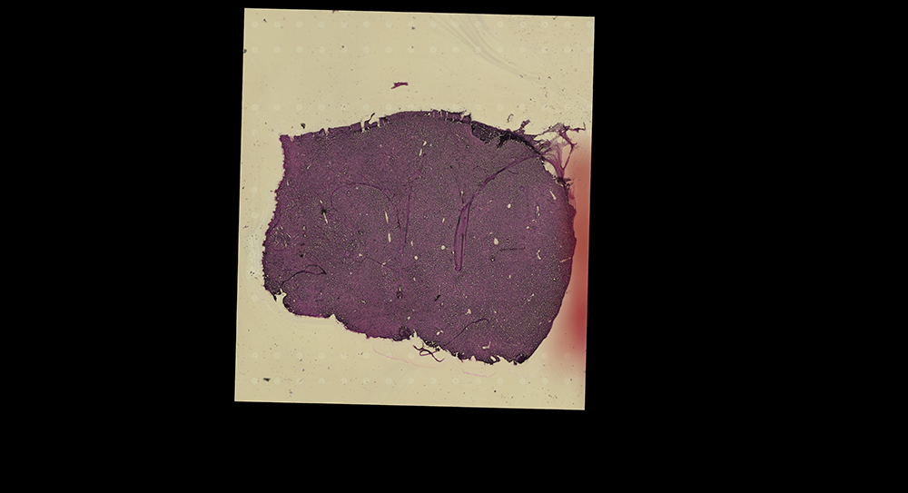

# Rule `historef`

## Purpose
The goal of `historef` rule is to match the histology image with the spatial coordinates of the spatial digital gene expression matrix (SGE). This is achieved by aligning fiducial markers observable in both the histology image and the [composite image](./align.md#3-a-comprehensive-view-of-sbcd-smatch-and-sge-images) of "sbcd", "smatch", and "sge" images.

## Input Files

* **A histology image**
Th histology image with fiducial markers is required. The [`historef`](https://github.com/seqscope/historef) identifies fiducial marks by detecting the brightness in the input histology image, so it is crucial that fiducial markers are the brightest area in the histology image.

* **The composite image**
The [composite image](./align.md#3-a-comprehensive-view-of-sbcd-smatch-and-sge-images), which shows "sbcd", "smatch", and "sge" images side-by-side, will also be applied to [`historef`](https://github.com/seqscope/historef).

## Output Files
The rule generates the following output in the specified directory path:
```
<output_directory>/histology/<flowcell_id>/<chip_id>/aligned/<run_id>
```

### (1) A referenced Histology File
**Description**:
The referenced histology file, which is in [GeoTIFF](https://en.wikipedia.org/wiki/GeoTIFF)format, allows the coordinate transformation between the SGE matrix and the input histology image.

**File Naming Convention**:

```
<histology_resolution>X<flowcell_abbreviation>-<chip_id>-<species>-<histology_figtype>.tif"
```

 * The `histology_resolution` and `histology_figtype` are derived from the `resolution` and `figtype` fields within the `histology` section of the [job configuration](../../getting_started/job_config.md) file.
 * The `flowcell_abbreviation` is derived by splitting the `flowcell_id`, which is sourced from the `flowcell` field in `input` section of the [job configuration](./path-to-job-configuration) file, by "-" and taking the first part.

**File Visualization**:
<figure markdown="span">
{ width="60%" }
</figure>

The image displayed above only serves an initial glimpse into the results but has been substantially reduced in size and is presented in PNG format.

For an in-depth examination, access the full-size referenced histology file within the [`B08Cshallow_20240319_SGE_withHE.tar.gz`](https://doi.org/10.5281/zenodo.10841778) tarball.


### (2) A Re-sized Referenced Histology File
**Description**:
An TIFF file shares the identical dimensions with both the ["smatch" image](./smatch.md#2-a-smatch-image) and the ["sge" image](./dge2sdge.md#2-an-sge-image), acilitating the comparison of consistency between the histology file and these images.

**File Naming Convention**:

```
<histology_resolution>X<flowcell_abbreviation>-<chip_id>-<species>-<histology_figtype>-fit.tif"
```

 * The `histology_resolution` and `histology_figtype` are derived from the `resolution` and `figtype` fields within the `histology` section of the [job configuration](../../getting_started/job_config.md) file.
 * The `flowcell_abbreviation` is derived by splitting the `flowcell_id`, which is sourced from the `flowcell` field in `input` section of the [job configuration](./path-to-job-configuration) file, by "-" and taking the first part.

**File Visualization**:
<figure markdown="span">
{ width="100%" }
</figure>

The full-size TIFF is provided in the [`B08Cshallow_20240319_SGE_withHE.tar.gz`](https://doi.org/10.5281/zenodo.10841778).

## Output Guidelines
To verify the accuracy of the alignment, it is recommended to compare the [re-sized referenced histology file](#2-a-re-sized-referenced-histology-file) against the ["smatch" image](./smatch.md#2-a-smatch-image) and the ["sge" image](./dge2sdge.md#2-an-sge-image), ensuring a precise match with the histology images. A clear visibility of fiducial marks in both images indicates an accurate match with submicrometer resolution upon overlay. If the fiducial marks are insufficiently visible or aligned incorrectly, manual adjustment of the histology images is required.

## Parameters

The following parameter in the [job configuration](../../getting_started/job_config.md) file will be applied in this rule.

```yaml
histology:
    resolution: 10
    figtype: "hne"
```

* **The `histology` Parameters**
    The `resolution` and `figtype` indicates the resolution and type of the input histology file. The [`historef`](https://github.com/seqscope/historef) currently support the following types:
    * `"hne"`: [Hematoxylin and Eosin (H&E) stained](https://en.wikipedia.org/wiki/H%26E_stain) histology images;
    * `"dapi"`: [DAPI or 4',6-diamidino-2-phenylindole stained](https://en.wikipedia.org/wiki/DAPI) histology images;
    * `"fl"`: Fluorescence stained histology images.

## Dependencies
Rule `historef` commences only after Rule [`dge2sdge`](./dge2sdge.md) has successfully executed. An overview of the rule dependencies are provided in the [Workflow Structure](../../home/workflow_structure.md).

## Code Snippet
The code for this rule is provided in [b02_historef.smk](https://github.com/seqscope/NovaScope/blob/main/rules/b02_historef.smk)
